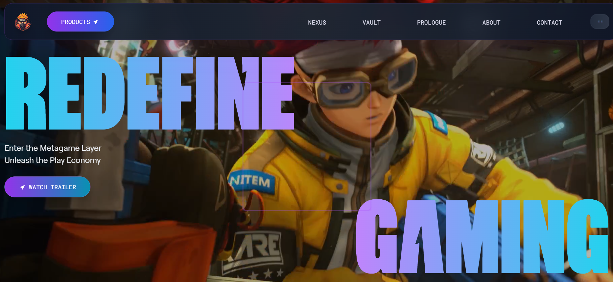
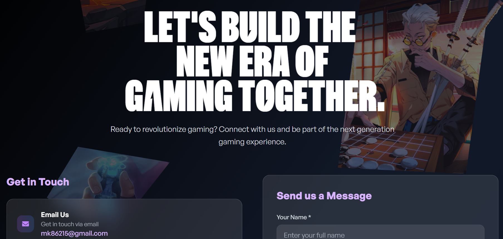
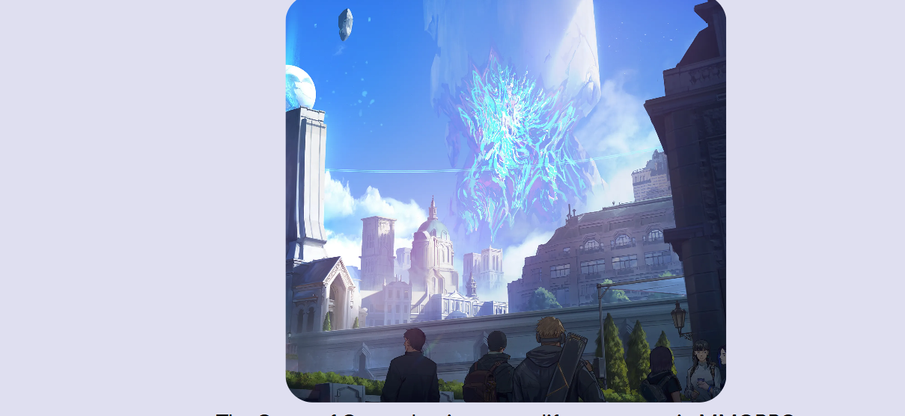

## 🎮 MGaming - Next-Generation Gaming Website

A modern and immersive gaming platform built with **React**, **Vite**, and **Tailwind CSS**, showcasing interactive elements, responsive layouts, and engaging animations.

---

## 🔥 Live Preview

Visit: [https://kumarmanish562.github.io/MGaming/](https://kumarmanish562.github.io/MGaming/g)

---

## 📸 Screenshots

### 🖥️ Home Page  



### 📧 Contact Form  


### 🎮 3D Tilt Effect Showcase  


---

## 📌 Description

**MGaming** is a next-generation gaming web interface designed to highlight the latest in gaming experiences. Built with cutting-edge technologies, it emphasizes responsive design, animation-rich interactivity, and a sleek, modern UI.

---

## 🚀 Features

- 🎞️ Interactive video carousel
- 📱 Fully responsive design for all devices
- 🎧 Smart navigation with audio controls
- 🌀 Scroll-based dynamic animations (GSAP)
- ✉️ Contact form with input validation
- 🎮 3D tilt effects on game cards and interactive UI elements

---

## 🛠️ Installation

```bash
# 1. Clone the repository
git clone https://github.com/kumarmanish562/MGaming.git
cd MGaming

# 2. Install dependencies
npm install

# 3. Start the development server
npm run dev


Then open your browser and visit: http://localhost:5173

📁 Project Structure

MGaming/
├── public/
├── src/
│   ├── assets/
│   ├── components/
│   ├── pages/
│   ├── App.jsx
│   └── main.jsx
├── tailwind.config.js
├── vite.config.js
└── package.json
🧰 Technologies Used
⚛️ React.js

⚡ Vite

🎨 Tailwind CSS

🌀 GSAP (GreenSock Animation Platform)

🔊 React Icons

🌐 Deployment (GitHub Pages)

# 1. Install GitHub Pages
npm install gh-pages --save-dev

# 2. Add the following to your package.json
"homepage": "https://kumarmanish562.github.io/MGaming",
"scripts": {
  "predeploy": "npm run build",
  "deploy": "gh-pages -d dist"
}

# 3. Deploy
npm run deploy
Your site will be available at: https://kumarmanish562.github.io/MGaming/

📜 License
This project is licensed under the MIT License. See the LICENSE file for details.

📬 Contact
Manish Kumar
📧 Email: mk86215@gmail.com


Made with ❤️ for gamers by gamers.


